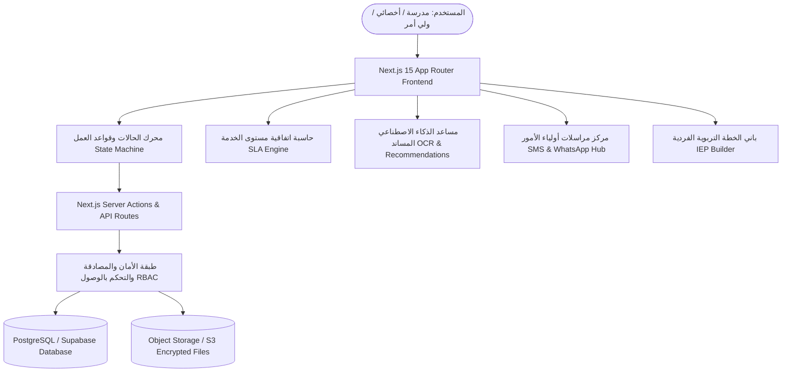

# المعمارية الفنية لمنصة «شخّصني» (System Architecture Blueprint)

منصة **«شخّصني»** هي نظام مؤسسي رقمي متكامل لإدارة وتأطير رحلة تشخيص الطلاب ذوي الإعاقة والموهوبين في المملكة العربية السعودية، مصممة وفق أحدث المعايير الهندسية وقابلة للتوسع السحابي.

---

## 🏛️ نظرة عامة على المعمارية (High-Level Architecture)

---

## ⚙️ المكونات الرئيسية للمنظومة

### 1. محرك الحالات التشغيلية (Deterministic State Machine Engine)
تخضع كل حالة تشخيصية لمصفوفة انتقالات صارمة ومحددة تمنع القفز العشوائي وتضمن توثيق التدقيق الزمني:
- **`DRAFT` (مسودة):** التجهيز الأولي.
- **`SUBMITTED` (مقدم):** إرسال الطلب للمركز.
- **`DOC_REVIEW` (مراجعة الوثائق):** فحص الهوية والتقارير الطبية.
- **`DOC_INCOMPLETE` (وثائق غير مكتملة):** إيقاف الـ SLA مؤقتاً وطلب الاستكمال من ولي الأمر.
- **`PRIORITY_TRIAGE` (فرز الأولوية وتشكيل الفريق):** تصنيف الحالات وتعيين رئيس الفريق والأخصائيين.
- **`APPOINTMENT_SCHEDULED` (جدولة الموعد):** حجز الجلسات التشخيصية ومنع التعارض.
- **`UNDER_EVALUATION` (جلسات التقييم والفحص):** تطبيق مقاييس وكسلر، ستانفورد، جيليام، فينلاند.
- **`DRAFT_REPORT` (مسودة التقرير والتوصيات):** إعداد مسودة التقرير وخطط IEP.
- **`TEAM_LEADER_REVIEW` (مراجعة رئيس الفريق):** المصادقة الإكلينيكية الفنية.
- **`APPROVED` (معتمد رسمياً):** الختم الرقمي، إصدار رمز التوثيق الوطني، وتوليد رمز QR.
- **`DELIVERED` (تم التسليم لولي الأمر):** إشعار الأسرة واستلام الوثيقة المعتمدة.
- **`CLOSED` (مغلق ومؤرشف):** أرشفة الملف في السجل الوطني للتربية الخاصة.

### 2. محرك اتفاقية مستوى الخدمة الذكي (Smart SLA Engine)
- حساب الأيام الإجمالية والمتبقية لكل طلب حسب درجة الأولوية (`CRITICAL: 3 days`, `URGENT: 7 days`, `STANDARD: 10 days`, `ROUTINE: 15 days`).
- **الإيقاف التلقائي الذكي:** يتوقف عداد الأيام تلقائياً عند حالة `DOC_INCOMPLETE` لعدم ظلم المركز أثناء انتظار استجابة ولي الأمر، ويُستأنف فور استكمال الملف.

### 3. مصفوفة الصلاحيات والأمان (Role-Based Access Control - RBAC)
تتضمن المنصة 8 أدوار وظيفية مستقلة:
1. **`SYSTEM_ADMIN` (مدير النظام):** التحكم الكامل، إعدادات المنظومة، ومراقبة سجلات التدقيق.
2. **`RECEPTIONIST` (موظف الاستقبال):** تدقيق الوثائق، استلام الطلبات، وتأكيد الحضور.
3. **`CENTER_COORDINATOR` (منسق المركز):** إدارة القدرة الاستيعابية، وتوزيع الأحمال.
4. **`DIAGNOSTIC_MEMBER` (الأخصائي):** تطبيق المقاييس، وإدخال درجات المجالات الفرعية.
5. **`TEAM_LEADER` (رئيس الفريق):** التوجيه الفني، مصادقة المسودات، واعتماد التوصيات.
6. **`SUPERVISOR` (المشرف / المدير العام):** الاعتماد النهائي، الختم الرقمي المشفر، والتقارير الإحصائية.
7. **`SCHOOL_REP` (ممثل المدرسة):** ترشيح الطلاب، متابعة سير الحالات المدرسية.
8. **`PARENT` (ولي الأمر):** التقديم المباشر، رفع التقارير، تأكيد المواعيد، واستلام النتيجة.

### 4. التشفير والتحقق الرقمي (Digital Stamp & SHA-256 Verification)
- توليد بصمة رقمية مشفرة (Cryptographic Hash) لكل تقرير معتمد.
- رمز استجابة سريعة تفاعلي (Interactive QR Code) يرتبط ببوابة التحقق الوطنية العامة `/verify/[id]` دون الحاجة لتسجيل الدخول، مما يسمح للجهات الحكومية والمدارس بالتحقق من أصالة التقرير فورياً.
